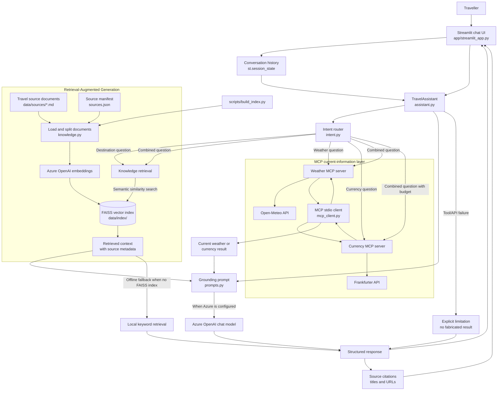

# Singapore Travel Assistant

A context-aware travel planning assistant for Singapore. The application combines
document-grounded destination knowledge with current weather and currency information
retrieved through MCP tools.

## GitHub Repo Url
https://github.com/VarunSemwal/AI-TRAVEL-PLANNING-ASSISTANT

## Architecture

- `data/sources/` contains three source-linked Singapore travel summaries and a manifest.
- `src/travel_assistant/knowledge.py` chunks documents, creates Azure OpenAI embeddings,
	stores them in FAISS, and preserves citation metadata.
- `src/travel_assistant/assistant.py` routes knowledge, weather, currency, and combined
	requests. It uses FAISS when an index exists and a transparent local fallback otherwise.
- `src/travel_mcp_servers/` contains two local MCP v2 servers: weather and currency.
- `src/travel_assistant/mcp_client.py` connects to those servers over MCP stdio.
- `app/streamlit_app.py` provides the conversational UI and displays sources, tool usage,
	current data, recommendations, and limitations.

## Architecture Diagram



### Diagram Reading Guide

1. The traveller submits a question through Streamlit.
2. `TravelAssistant` classifies the request and selects the required path.
3. Destination questions use the travel documents and FAISS retrieval.
4. Current questions use the appropriate MCP server and external API.
5. Combined questions use both retrieved destination context and current MCP data.
6. Azure OpenAI generates a grounded response when configured.
7. Without Azure or a generated FAISS index, the application uses local keyword retrieval.
8. Tool failures are shown as limitations instead of being replaced with guesses.
9. The UI displays the answer, source citations, current-data indicators, and tools used.

## Setup

```powershell
py -3.13 -m venv .venv
.\.venv\Scripts\Activate.ps1
python -m pip install --upgrade pip
pip install -e ".[dev]"
Copy-Item .env.example .env
```

Fill in the Azure OpenAI values in `.env` before using the LLM or embedding workflow.

The `.env.example` file must contain placeholders only. If a real key was previously
placed in the file, revoke it in Azure and create a replacement before continuing.

## Build the semantic index

Add the source content according to each source's reuse terms, then run:

```powershell
.\.venv\Scripts\python.exe scripts\build_index.py
```

The index is written to `data/index/` and is ignored by Git. Without Azure credentials
or an index, the application still runs its citation-preserving local retrieval fallback.

## Run the UI

```powershell
streamlit run app\streamlit_app.py
```

## MCP servers

The application starts the MCP servers on demand through the configured stdio commands.
The server files can also be run independently for inspection:

```powershell
.\.venv\Scripts\python.exe src\travel_mcp_servers\weather_server.py
.\.venv\Scripts\python.exe src\travel_mcp_servers\currency_server.py
```

The weather server uses Open-Meteo. The currency server uses Frankfurter and returns the
provider date and rate in its result. Both failures are surfaced instead of guessed.

## Demonstration questions

- `What are the must-visit attractions in Singapore?`
- `What is the weather in Singapore?`
- `Convert INR 50000 to SGD`
- `I have a budget of INR 60,000. Convert it to SGD and suggest a three-day itinerary..`
- Follow up with a preference such as `Make it suitable for a family with children.`
